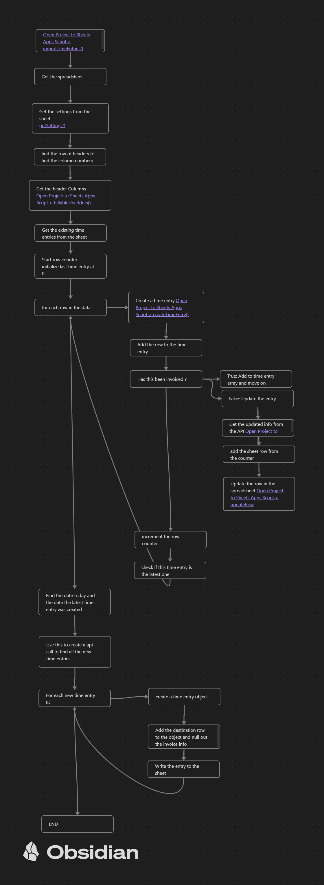

# Background
OpenProject is a **free and open-source project management software** designed to support various methodologies, including traditional, agile, and hybrid approaches. It offers a comprehensive suite of features to help teams of all sizes plan, track, and collaborate on projects efficiently.

I'm using [OpenProject](https://www.openproject.org/) to track various projects I'm working on. I want to be able to track the time I use in a google spreadsheet. OpenProject has an API so I'm writing apps script to use that API to read out time elements. 

# Design
## Interface
We will use a google spreadsheet to hold the settings and call the functions to run the code. 

## Flow


# Code
The functions below are used to import data from OpenProject

## [[getSettings()]]
Pull the settings from the Sheet

## importTimeEntries()
This is the function that gathers all the existing time entries and updates them, Then figures out if there are any new time entries by seeing if any were created after the latest time entry currently in the sheet. Then it adds those time entries

```javascript
/**
 * importTimeEntries - Function to import time entries to spreadsheet
 * 
 */
function importTimeEntries() {
  // Get the active spreadsheet
  const ss = SpreadsheetApp.getActiveSpreadsheet();
  // Get the settings from the settings worksheet
  const settings = getSettings(ss.getId());
  // Get the billable hours sheet
  const billableSheet = ss.getSheetByName("Billable Hours");
  // Get the header row and find the right column numbers
  const headerCols = billableHeaders(billableSheet.getRange(1, 1, 1, billableSheet.getLastColumn()).getValues()[0]);
  // Get the data from the billable hours sheet
  const billableHours = billableSheet.getRange(2, headerCols.dateCol + 1, billableSheet.getLastRow() - 1, billableSheet.getLastColumn()).getValues();
  // Create the time entries array
  const timeEntries = [];
  let bsRow = 2;
  let lastTimeEntryId = 0;
  // Iterate through each row in the billable hours sheet
  for (row of billableHours) {
    let timeEntry = createTimeEntry(row, headerCols);
    timeEntry.row = bsRow;
    // Check if the time entry is invoiced if not update sheet
    if(timeEntry.invoiced === false){
      Logger.log("Not Invoiced, needs updating row "+bsRow+" with time entry id "+timeEntry.timeEntryId);
      let updatedTimeEntry = createTimeEntryObject(timeEntry.timeEntryId, settings);
      updatedTimeEntry.row = bsRow;
      Logger.log(updatedTimeEntry)
      updateRow(updatedTimeEntry, headerCols);
    }
    bsRow++;
    timeEntries.push(timeEntry);
    // Check if the time entry ID is greater than the last time entry ID
    if(lastTimeEntryId < timeEntry.timeEntryId){
      lastTimeEntryId = timeEntry.timeEntryId;
    }
  }
  // Find the URL for the api call that will pull un imported time entries
  Logger.log("Last Time Entry ID "+lastTimeEntryId);
  const now = new Date();
  const dateOfLastTimeEntry = Utilities.parseDate(createTimeEntryObject(lastTimeEntryId, settings).createdAt, "GMT", "yyyy-MM-dd'T'HH:mm:ss'Z'");
  const start = new Date(dateOfLastTimeEntry.getTime()+1000);
  const filters = [
    {
      "created_at": {
        "operator": "<>d",
        "values": [start, now.toISOString()]
      }
    }
  ];
  let url = "https://projects.lickylips.duckdns.org/api/v3/time_entries/?"+"filters="+JSON.stringify(filters);
  let stringifyUrl = encodeURI(url);
  Logger.log(stringifyUrl);

  // Get the un imported time entries
  const newTimeEntryResult = importJSON(stringifyUrl, settings);
  const newTimeEntries = newTimeEntryResult._embedded.elements;
  Logger.log(newTimeEntries.length)
  for(newTimeEntry of newTimeEntries){
    Logger.log("New Time Entry "+newTimeEntry.id);
    let newTimeEntryObject = createTimeEntryObject(newTimeEntry.id, settings);
    newTimeEntryObject.row = bsRow;
    bsRow++;
    timeEntries.push(newTimeEntryObject);
    newTimeEntryObject.invoiced = false;
    newTimeEntryObject.invoiceNumber = "";
    Logger.log("Adding new Time Entry " + newTimeEntryObject.timeEntryId+" on row "+bsRow);
    updateRow(newTimeEntryObject, headerCols);
  }
}
```
## billableHeadders()
This function takes the first row of the spreadsheet and finds the column numbers for each of the relevant headers

```javascript
/**
 * Function to figure ot the columns of the data
 * @param {array} headerRow row containing headers  
 * @returns 
 */
function billableHeaders(headerRow){
  const headers = {};
  for(i in headerRow){
    if(headerRow[i] == "Date"){headers.dateCol = Number(i);}
    if(headerRow[i] == "Project"){headers.projectCol = Number(i);}
    if(headerRow[i] == "Hours"){headers.hoursCol = Number(i);}
    if(headerRow[i] == "Company Sponsor"){headers.companyCol = Number(i);}
    if(headerRow[i] == "Invoiced"){headers.invoicedCol = Number(i);}
    if(headerRow[i] == "Rate"){headers.rateCol = Number(i);}
    if(headerRow[i] == "Amount"){headers.amountCol = Number(i);}
    if(headerRow[i] == "Invoice Number"){headers.invoiceNumberCol = Number(i);}
    if(headerRow[i] == "Notes"){headers.notesCol = Number(i);}
    if(headerRow[i] == "Time Entry ID"){ headers.timeEntryIdCol = Number(i);}
  }
  return headers;
}
```

## createTimeEntry()
converts a row from the spreadsheet to a time entry object

```javascript
/**
 * Function to create a time entry object
 * @param {array} row row containing data
 * @param {object} headers object containing the columns
 * @returns {object} timeEntry object
 */
 function createTimeEntry(row, headers){
  const timeEntry = {};
  timeEntry.date = row[headers.dateCol];
  timeEntry.project = row[headers.projectCol];
  timeEntry.hours = row[headers.hoursCol];
  timeEntry.company = row[headers.companyCol];
  timeEntry.invoiced = row[headers.invoicedCol];
  timeEntry.rate = row[headers.rateCol];
  timeEntry.amount = row[headers.amountCol];
  timeEntry.invoiceNumber = row[headers.invoiceNumberCol];
  timeEntry.notes = row[headers.notesCol];
  timeEntry.timeEntryId = row[headers.timeEntryIdCol];
  return timeEntry;
 }
```

## createTimeEntryObject()
Takes the ID of a time entry and the settings, reterives the time entry via the api (using [[#importJSON()]]) and returns an object with the time entry

```javascript
/**Function to create a time entry object from the result of an api call
 * @param {object} timeEntryResult result of time entry api call
 * @param {object} settings object containing settings
 * @returns {object} timeEntry object
 */
function createTimeEntryObject(timeEntryId, settings) {
  const url = "https://projects.lickylips.duckdns.org/api/v3/time_entries/"+timeEntryId;
  const timeEntryResult = importJSON(url, settings);
  const timeEntry = {};
  timeEntry.date = timeEntryResult.spentOn;
  timeEntry.project = timeEntryResult._embedded.project.name;
  timeEntry.hours = convertDurationToHours(timeEntryResult.hours);
  timeEntry.company = settings.companyName;
  timeEntry.rate = settings.rate;
  timeEntry.amount = timeEntry.hours * settings.rate;
  timeEntry.notes = timeEntryResult._embedded.workPackage.subject + " - " + timeEntryResult.comment.raw;
  timeEntry.timeEntryId = timeEntryResult.id;
  timeEntry.createdAt = timeEntryResult.createdAt;
  return timeEntry;
}
```
## importJSON()
This function will actually run the API call using the provided URL. 

```javascript
/**
 * importJSON function to take url and return data
 * @param {string} url 
 * @returns 
 */
function importJSON(url, settings) {
    const username = "apikey";
    const password = settings.apiKey
    const apiToken = Utilities.base64Encode(username+":"+password);
    const headers = {
    // Insert a Basic Auth Token of an OpenProject account to get access to the API
        "Authorization" : "Basic "+apiToken, 
    };
    const params = {
        "method": "GET",
        "headers": headers
    };
    const response = UrlFetchApp.fetch(url, params);
    const json = response.getContentText();
    const data = JSON.parse(json);
    return data;
} 
```

## updateRow()
This function takes time entry object that includes the row that it is from or destined for and the settings then writes it to the spreadsheet. It also coverts the invoiced col to a checkbox

```javascript
/**
 * updateRow function to update a row in a spreadsheet
 * @param {object} timeEntry object
 */
function updateRow(timeEntry, headerCols) {
  const ss = SpreadsheetApp.getActiveSpreadsheet();
  const billableSheet = ss.getSheetByName("Billable Hours");
  const row = [];
  row[headerCols.dateCol] = timeEntry.date;
  row[headerCols.projectCol] = timeEntry.project;
  row[headerCols.hoursCol] = timeEntry.hours;
  row[headerCols.companyCol] = timeEntry.company;
  row[headerCols.invoicedCol] = timeEntry.invoiced;
  row[headerCols.rateCol] = timeEntry.rate;
  row[headerCols.amountCol] = timeEntry.hours * timeEntry.rate;
  row[headerCols.invoiceNumberCol] = timeEntry.invoiceNumber;
  row[headerCols.notesCol] = timeEntry.notes;
  row[headerCols.timeEntryIdCol] = timeEntry.timeEntryId;
  billableSheet.getRange(timeEntry.row, 1, 1, billableSheet.getLastColumn()).setValues([row]);
  billableSheet.getRange(timeEntry.row, headerCols.invoicedCol+1).insertCheckboxes();
}
```
## convertDurationToHours
This function does a regex match on the text string of duration that comes in the format XXhYYmZZs. It converts this into just a decimal of hours.

```javascript
/**
 * convertDurationToHours function to take a string of duration and convert it to an
 * amount of hours
 * @param {string} durationString 
 * @returns 
 */
function convertDurationToHours(durationString) {
  // Extract hours, minutes, and seconds using regular expressions
  var regex = /PT(?:(\d+)H)?(?:(\d+)M)?(?:(\d+)S)?/;
  var match = durationString.match(regex);

  if (match) {
    var hours = match[1] ? parseInt(match[1]) : 0;
    var minutes = match[2] ? parseInt(match[2]) : 0;
    var seconds = match[3] ? parseInt(match[3]) : 0;
    
    // Calculate total duration in hours
    var totalHours = hours + minutes / 60 + seconds / 3600;
    return totalHours;
  } else {
    throw new Error("Invalid duration format");
  }
}
```

## updateRow
This function writes time entry data to the spreadsheet

```javascript
/**
 * updateRow function to update a row in a spreadsheet
 * @param {object} timeEntry object
 */
function updateRow(timeEntry) {
  const ss = SpreadsheetApp.getActiveSpreadsheet();
  const billableSheet = ss.getSheetByName("Billable Hours");
  const headerCols = billableHeaders(billableSheet.getRange(1, 1, 1, billableSheet.getLastColumn()).getValues()[0]);
  const billableHours = billableSheet.getRange(2, headerCols.dateCol + 1, billableSheet.getLastRow() - 1, billableSheet.getLastColumn()).getValues();
  const row = billableHours[timeEntry.row - 2];
  row[headerCols.dateCol] = timeEntry.date;
  row[headerCols.projectCol] = timeEntry.project;
  row[headerCols.hoursCol] = timeEntry.hours;
  row[headerCols.companyCol] = timeEntry.company;
  row[headerCols.invoicedCol] = timeEntry.invoiced;
  row[headerCols.rateCol] = timeEntry.rate;
  row[headerCols.amountCol] = timeEntry.hours * timeEntry.rate;
  row[headerCols.invoiceNumberCol] = timeEntry.invoiceNumber;
  row[headerCols.notesCol] = timeEntry.notes;
  row[headerCols.timeEntryIdCol] = timeEntry.timeEntryId;
  billableSheet.getRange(timeEntry.row, 1, 1, billableSheet.getLastColumn()).setValues([row]);
}
```

## onOpen()
Standard onOpen function to add menu items

```javascript
/**
 * On Open of billable hours spreadsheet
 * 
 */
function onOpen() {
  var ui = SpreadsheetApp.getUi();
  // Create a main menu item
  ui.createMenu('Invoicing')
      .addItem('Generate Invoices', 'runMain')
      .addItem("Import Open Project Data", "importTimeEntries")
      .addToUi();
}
```